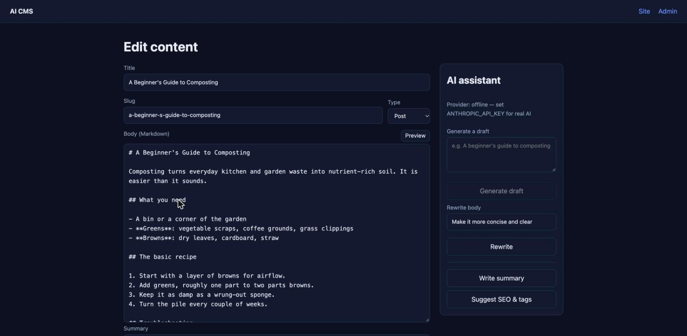
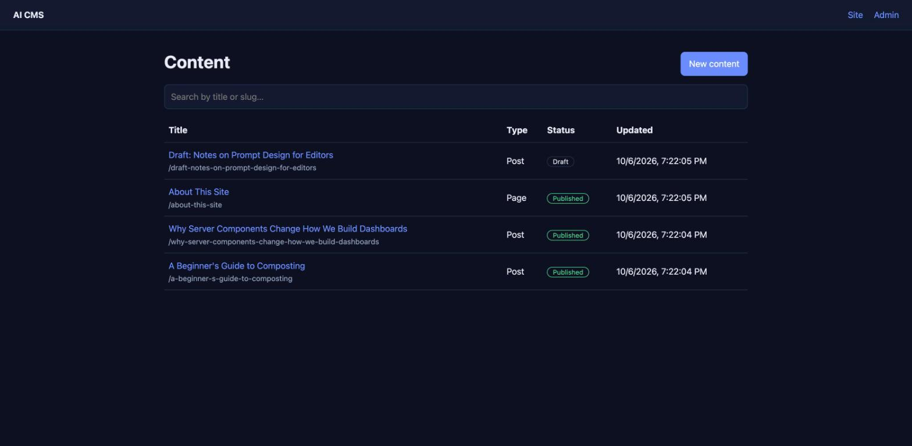
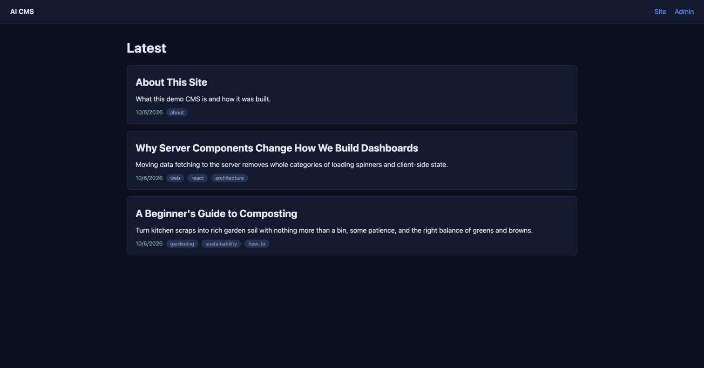
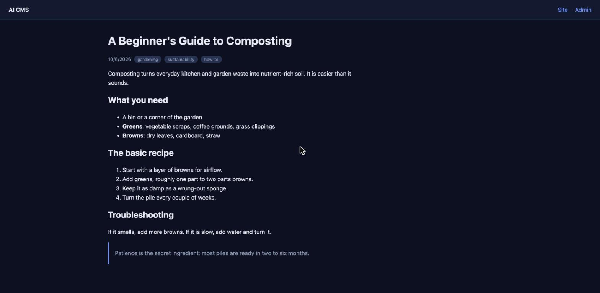
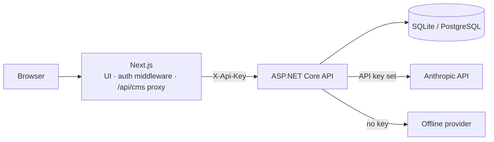

# AI CMS

[](https://github.com/terojleinonen/cms-template-repo/actions/workflows/ci.yml)


A small, production-minded content management system with AI writing tools built into the editor. Editors draft, rewrite, summarize and SEO-optimize content with Claude, review the result, and publish it to a public site.



<details>
<summary><b>More screenshots</b></summary>

| Admin dashboard | Public home page |
|---|---|
|  |  |



*Screenshots use seeded demo content and the offline AI provider (no API key), which is why the panel shows "Provider: offline". With a key it shows `anthropic:<model>` and generates real text.*
</details>

## Features

- **Content management:** posts and pages with Markdown bodies, tags, SEO fields, unique slugs, a draft/publish workflow, search and pagination.
- **AI assistant in the editor:** generate a draft from a brief, rewrite with a free-form instruction, write a summary, and suggest SEO title, description, slug and tags. AI output only fills form fields; nothing is saved until the editor clicks *Save*.
- **Graceful AI fallback:** with no API key the app uses a deterministic offline provider, so demos, tests and CI run without network access or cost.
- **Public site:** server-rendered list and article pages with per-page SEO metadata. Markdown is rendered without raw HTML, so editor content cannot inject scripts.
- **Secure by default:** admin and AI routes require an API key (constant-time comparison); the admin UI sits behind a password; the API key stays on the Next.js server and never reaches the browser; AI endpoints are rate-limited; provider errors are logged server-side and never leaked to clients.

## Architecture



The browser only talks to Next.js. The Next.js server authenticates the editor, then forwards admin calls to the API with a secret key, so no credential is exposed client-side.

```
backend/src/
  Cms.Domain/          entities (ContentItem)
  Cms.Application/     DTOs, validation, service and AI interfaces, slug logic
  Cms.Infrastructure/  EF Core DbContext, ContentService, provider selection
  Cms.Ai/              AnthropicAiTextService, OfflineAiTextService
  Cms.Api/             minimal-API endpoints, auth filter, rate limiting, ProblemDetails
backend/tests/         unit + integration tests (xUnit, WebApplicationFactory)
frontend/              Next.js app: public site, admin dashboard, editor
scripts/smoke-test.sh  end-to-end check against a running stack
```

### Design decisions

- **Clean layering:** the Application layer owns the interfaces (`IContentService`, `IAiTextService`); Infrastructure and Ai implement them. Swapping the AI provider means writing one class.
- **Provider selection at startup:** `Anthropic:ApiKey` set ⇒ Claude, otherwise offline. The AI client uses the Messages API over a typed `HttpClient`, with the model configurable.
- **Prompt-injection hygiene:** user text is wrapped in `<content>` tags and the system prompt tells the model to treat it as material, not instructions.
- **Tags as JSON text:** one model works on both SQLite and PostgreSQL without provider-specific column types.
- **Errors as RFC 7807 problem details:** `400` validation, `401`, `404`, `409` duplicate slug, `429`, `502` AI provider failure.

## Quick start

### With Docker (PostgreSQL + API + web)

```bash
cp .env.example .env        # set the secrets; add ANTHROPIC_API_KEY for real AI
docker compose up --build
```

Site: <http://localhost:3000> · Admin: <http://localhost:3000/admin> (any username, password = `ADMIN_PASSWORD`).

### Local development

Requires the .NET 10 SDK and Node 22+.

```bash
# API  (http://localhost:5000, SQLite file ./cms.db; Swagger at /swagger in Development)
cd backend/src/Cms.Api
ASPNETCORE_ENVIRONMENT=Development ASPNETCORE_URLS=http://localhost:5000 dotnet run
# optional real AI: add  Anthropic__ApiKey='sk-ant-...'  to the environment

# Web  (http://localhost:3000)
cd frontend
npm install
API_BASE_URL=http://localhost:5000 ADMIN_API_KEY=dev-admin-key ADMIN_PASSWORD=change-me npm run dev
```

In Development the API's admin key defaults to `dev-admin-key`.

### Tests

```bash
cd backend && dotnet test          # 23 unit + integration tests
cd frontend && npm run typecheck && npm run build

# end-to-end smoke test against a running stack (what CI runs after `docker compose up`)
ADMIN_PASSWORD=<your password> scripts/smoke-test.sh
```

CI runs the backend tests, the frontend type check, build and dependency audit, and a full `docker compose up` smoke test on PostgreSQL.

## Configuration

| Setting | Where | Purpose |
|---|---|---|
| `Auth__AdminApiKey` | API | Required for `/api/admin/**`. Unset ⇒ admin routes return 503. |
| `Anthropic__ApiKey` / `Anthropic__Model` | API | Enables Claude; empty ⇒ offline provider. |
| `Database__Provider` | API | `Sqlite` (default) or `Postgres`. |
| `ConnectionStrings__Cms` | API | Connection string for the chosen provider. |
| `Cors__AllowedOrigins__0` | API | Only needed if browsers call the API directly. |
| `API_BASE_URL`, `ADMIN_API_KEY`, `ADMIN_PASSWORD` | Web | See `.env.example`. |

## API overview

| Route | Auth | Description |
|---|---|---|
| `GET /api/public/content`, `GET /api/public/content/{slug}` | none | Published content only |
| `GET/POST /api/admin/content`, `GET/PUT/DELETE /api/admin/content/{id}` | `X-Api-Key` | CRUD |
| `POST /api/admin/content/{id}/publish` · `/unpublish` | `X-Api-Key` | Workflow |
| `POST /api/admin/ai/generate` · `rewrite` · `summarize` · `seo`, `GET …/ai/status` | `X-Api-Key` | AI tools (30 req/min/IP) |
| `GET /health` | none | Liveness + database check |

## Known limitations / next steps

- **Schema management:** the schema is created with `EnsureCreated` on startup. Before evolving the schema in production, switch to EF Core migrations.
- **Single shared admin identity:** one API key and one password, no per-user accounts or roles. Swap in ASP.NET Identity or an OIDC provider for multi-user use.
- **Rate limiting is in-process** and per client IP; behind a proxy, configure forwarded headers or use a distributed limiter.
- Media uploads, content versioning and AI image generation are not implemented.

## License

[MIT](LICENSE)
